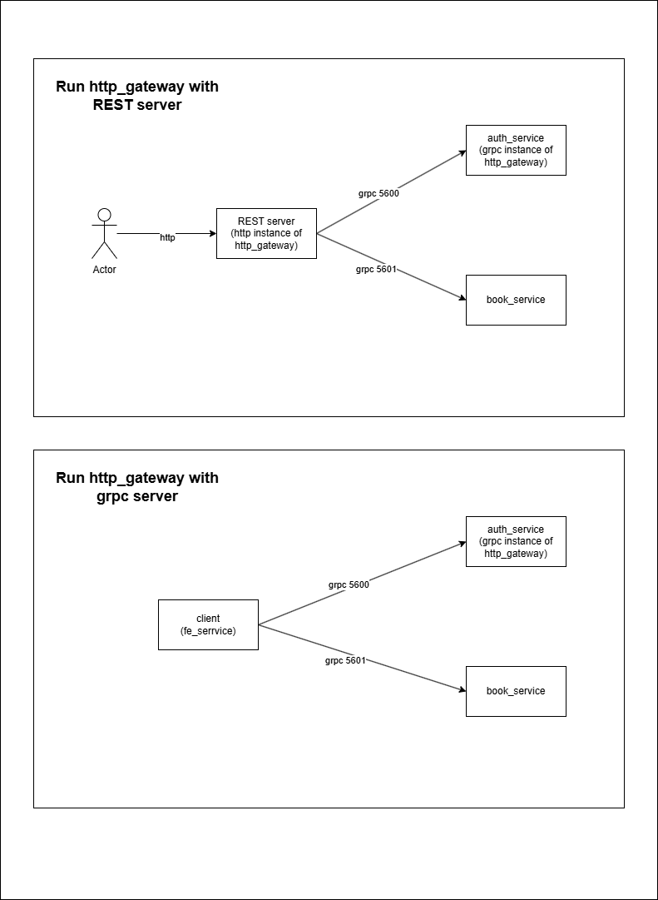
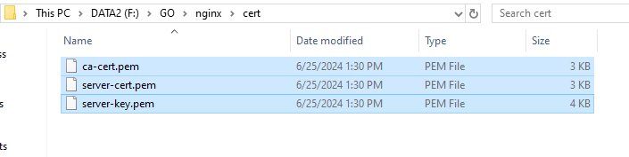

# Grpc
# Technologies

    1. grpc - "google.golang.org/grpc"
    2. grpc-gateway - "github.com/grpc-ecosystem/grpc-gateway/v2"
    3. grom - "gorm.io/gorm"
    4. jwt - "github.com/golang-jwt/jwt"



# 1. REST server

    1. `cd http_gateway` and run `make rest`
    2. in another terminal `cd http_gateway` and run `make server` to run server in grpc server
    3. call API by postman in `docs` folder

# 2. Grpc server

    1. `cd http_gateway` and run `make server` to run server in grpc server
    2. in another terminal `cd book_service` and run `make server` to run book server in grpc server
    3. in another terminal `cd fe_service` and run `make client` to run grpc client

# 3. TLS
    1. `cd http_gateway` and run `make server-tls` to run server in grpc server
    2. in another terminal `cd book_service` and run `make server` to run book server in grpc server
    3. in another terminal `cd fe_service` and run `make client-tls` to run grpc client

# 4. Nginx (It is not working now)

1. windows: [https://nginx.org/en/download.html](https://nginx.org/en/download.html)
2. macos: `brew install nginx`





```bash
nginx -t
# Output should be:
# nginx: the configuration file /etc/nginx/nginx.conf syntax is ok
# nginx: configuration file /etc/nginx/nginx.conf test is successful

netstat -an | find "8080"
# Output should indicate that NGINX is listening on port 8080, for example:
# TCP    0.0.0.0:8080           0.0.0.0:0              LISTENING
```
